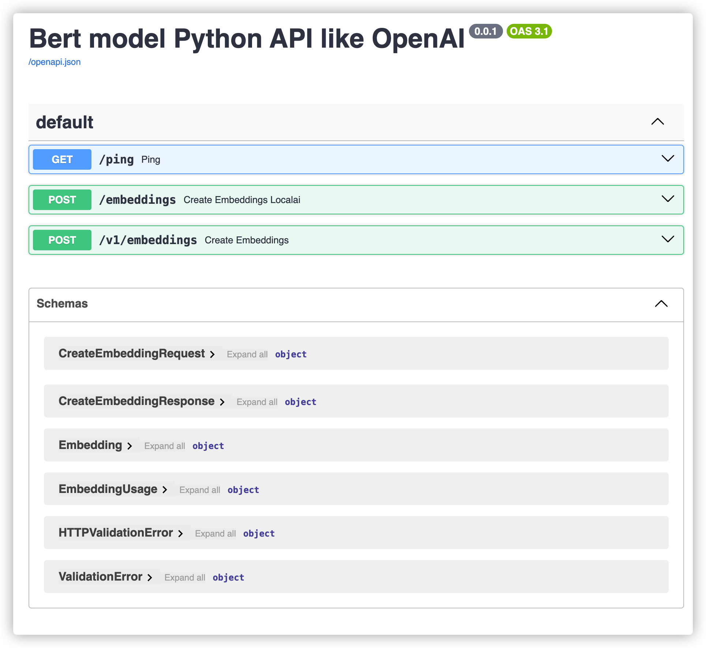

# Embedding API

> Implementation of OpenAI's Embedding API service, supporting BERT, SBERT, and CoSENT models. 🚀

<div align="center">

[中文](./readme.md) | [English](./readme_en.md)
</div>
<br />

## Deployment 🛠️

Taking `text2vec-base-chinese-paraphrase` as an example, first pull the image:
```shell
git lfs install
git clone https://huggingface.co/shibing624/text2vec-base-chinese-paraphrase
```

## Getting Started from the Project 🚀

Clone the project:
```shell
git clone https://github.com/charSLee013/Embedding-API
```

Install dependencies:
```shell
pip install -r requirements.txt
```

Start the service:
```shell
python3 server.py --model ./text2vec-base-chinese-paraphrase
```

## Getting Started from a Docker Container 🐳

Build the Docker image:
```shell
docker build -t embedding_api .
```

Run the container:
```shell
docker run --rm -p 8899:8899 -v /data/text2vec-base-multilingual/:/model embedding_api python server.py --model /model
```

# Usage 🚀

Start the test script within the project:
```shell
bash test_client.sh
```

The output should be similar to:
```json
{
  "object": "list",
  "model": "text-embedding-ada-002",
  "data": [
    {
      "index": 0,
      "object": "embedding",
      "embedding": [
        0.19880373775959015,
        ...[1024 field]
        0.18911297619342804
      ]
    }
  ],
  "usage": {
    "prompt_tokens": 26,
    "total_tokens": 26
  }
}
```

# Documentation 📚

After starting the server, open [http://localhost:8899/docs](http://localhost:8899/docs) directly in your browser.



## License 📝This project is licensed under the [MIT License](LICENSE).

## Issues and Pull Requests 🙋‍♀️If you encounter any issues or would like to contribute to this project, please feel free to open a new issue or submit a pull request on the [GitHub repository](https://github.com/charSLee013/Embedding-API). We appreciate your feedback and contributions! ❤️